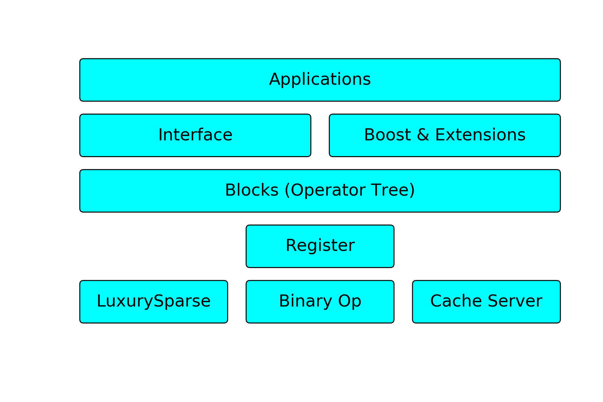

<div align="center"> </img>
<h1>Yao</h1>
</div>


[](https://travis-ci.org/QuantumBFS/Yao.jl)
[](https://ci.appveyor.com/project/Roger-luo/yao-jl)
[](https://coveralls.io/github/QuantumBFS/Yao.jl?branch=master)
[](https://codecov.io/gh/QuantumBFS/Yao.jl)
[](https://QuantumBFS.github.io/Yao.jl/stable)
[](https://QuantumBFS.github.io/Yao.jl/latest)

Extensible, Efficient Framework for Quantum Algorithm Design for humans.

## Introduction

Yao is an open source framework for

- quantum algorithm design;
- quantum machine learning;
- learning quantum computation.

on a classical computer.

## Installation

The package is registered. In Julia **v0.6**, you can use this command to install

```julia
julia> Pkg.add("Yao")
```

In **v0.7+**/**v1.0+**, please type `]` in the REPL to use the package mode, then type this command. Please notice that we might not be stable on **v0.7+** at the moment.

```julia
pkg> add Yao
```

## Documentation

- [**STABLE**](https://quantumbfs.github.io/Yao.jl/stable)
- [**LATEST**](https://quantumbfs.github.io/Yao.jl/latest)


## Motivation
Comparing with state of art quantum simulators, our library is inspired by quantum circuit optimization.
Variational quantum optimization algorithms like quantum circuit Born machine ([QCBM](https://arxiv.org/abs/1804.04168)), quantum approximate optimization algorithm ([QAOA](http://arxiv.org/abs/1411.4028)), variational quantum eigensolver ([VQE](https://doi.org/10.1038/ncomms5213)) and quantum circuit learning ([QCL](http://arxiv.org/abs/1803.00745)) et. al. are promising killer apps on a near term quantum computers.
These algorithms require the flexibility to tune parameters and have well defined patterns such as "Arbitrary Rotation Block" and "CNOT Entangler".

In Yao, we call these patterns "blocks". If we regard every gate or gate pattern as a "block", then the framework can

* be flexible to dispatch parameters,
* cache matrices of blocks to speed up future runs,
* allow hierarchical design of quantum algorithms

Thanks to Julia's duck type and multiple dispatch features, user can

* easily **extend** the block system by realizing specific interfaces
* quantum circuit blocks can be dispatched to some **specialize method**to push the performance in specific case (e.g. customize the repeat block of H gate).


## Features

Yao is a framework that is about to have the following features:

- **Extensibility**
  - define new operations with a minimum number of methods in principle.
  - extend with new operations on different hardware should be easy, (e.g GPUs, near term quantum devices, FPGAs, etc.)
- **Efficiency**
  - comparing with python, julia have no significant overhead on small scale circuit.
  - special optimized methods are dispatched to frequently used blocks.
  - double interfaces "apply!" and "cache server + mat" allow us to choose freely when to sacrifice memory for faster simulation and when to sacrifice the speed to simulate more qubits.
- **Easy to Use**
  - As a white-box simulator, rather than using a black box, users will be aware of what their simulation are doing right through the interface.
  - **Hierarchical APIs** from **low abstraction quantum operators** to **highly abstract** circuit block objects.


The whole framework is highly **modularized**, researchers can extend this framework for different purposes.

## Contribution

To contribute to this project, please open an [issue](https://github.com/QuantumBFS/Yao.jl/issues) first to discuss with us in case we may not accept your PR.

## Author

This project is an effort of QuantumBFS, an open source organization for quantum science. All the contributors are listed in the [contributors](https://github.com/QuantumBFS/Yao.jl/graphs/contributors).

## License

**Yao** is released under the Apache 2 license.
