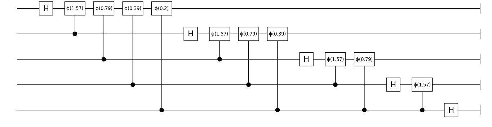
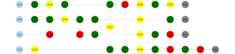
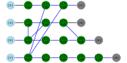

# YaoPlots

[](https://github.com/QuantumBFS/YaoPlots.jl/actions/workflows/CI.yml)
[](https://codecov.io/gh/QuantumBFS/YaoPlots.jl)

## Example 1: Visualize a QBIR define in Yao

```julia
using YaoExtensions, YaoPlots
using Compose

# show a qft circuit
plot(qft_circuit(5))
```

If you are using a Pluto/Jupyter notebook, Atom/VSCode editor, you should see the following image in your plotting panel.



Otherwise, you might be interested to learn [how to save it as an image](https://giovineitalia.github.io/Compose.jl/latest/tutorial/).

See more [examples](examples/circuits.jl).

### Adjusting the plot attributes

Various attributes of the visualizations can be altered. 
The plot can be modifiend, if we change the following attributes

- `YaoPlots.CircuitStyles.linecolor[]` for line color, default value being `"#000000"` (black color)
- `YaoPlots.CircuitStyles.gate_bgcolor[]` for background color of square blocks, the default value being `"#FFFFFF"` (white color)
- `YaoPlots.CircuitStyles.textcolor[]` for text color, default value being `"#000000`
- `YaoPlots.CircuitStyles.lw[]` for line width, default value being `1pt`
- `YaoPlots.CircuitStyles.textsize[]` for text size, default value being `16pt`
- `YaoPlots.CircuitStyles.paramtextsize[]` for parameter text size, for parameterized gates, default value being `10pt`

For example,

```julia
using YaoPlots, Yao
YaoPlots.CircuitStyles.linecolor[] = "pink" 
YaoPlots.CircuitStyles.gate_bgcolor[] = "yellow" 
YaoPlots.CircuitStyles.textcolor[] = "#000080" # the navy blue color
YaoPlots.CircuitStyles.fontfamily[] = "JuliaMono"
YaoPlots.CircuitStyles.lw[] = 2.5pt
YaoPlots.CircuitStyles.textsize[] = 13pt
YaoPlots.CircuitStyles.paramtextsize[] = 8pt
		
plot(chain(3, put(1=>X), repeat(3, H), put(2=>Y), repeat(3, Rx(π/2))))
```


## Example 2: Visualize ZX-diagrams in ZXCalculus
```julia
using ZXCalculus, YaoPlots
using Compose

function generate_example()
    zxd = ZXDiagram(4)
    push_gate!(zxd, Val{:Z}(), 1, 3//2)
    push_gate!(zxd, Val{:H}(), 1)
    push_gate!(zxd, Val{:Z}(), 1, 1//2)
    push_gate!(zxd, Val{:H}(), 4)
    push_gate!(zxd, Val{:CZ}(), 4, 1)
    push_gate!(zxd, Val{:CNOT}(), 1, 4)
    push_gate!(zxd, Val{:H}(), 1)
    push_gate!(zxd, Val{:H}(), 4)
    push_gate!(zxd, Val{:Z}(), 1, 1//4)
    push_gate!(zxd, Val{:Z}(), 4, 3//2)
    push_gate!(zxd, Val{:X}(), 4, 1//1)
    push_gate!(zxd, Val{:H}(), 1)
    push_gate!(zxd, Val{:Z}(), 4, 1//2)
    push_gate!(zxd, Val{:X}(), 4, 1//1)
    push_gate!(zxd, Val{:Z}(), 2, 1//2)
    push_gate!(zxd, Val{:CNOT}(), 3, 2)
    push_gate!(zxd, Val{:H}(), 2)
    push_gate!(zxd, Val{:CNOT}(), 3, 2)
    push_gate!(zxd, Val{:Z}(), 2, 1//4)
    push_gate!(zxd, Val{:Z}(), 3, 1//2)
    push_gate!(zxd, Val{:H}(), 2)
    push_gate!(zxd, Val{:H}(), 3)
    push_gate!(zxd, Val{:Z}(), 3, 1//2)
    push_gate!(zxd, Val{:CNOT}(), 3, 2)

    return zxd
end

zxd = generate_example() # define a example
plot(zxd) # draw a ZX-diagram
plot(ZXGraph(zxd)) # draw a graph-like ZX-diagram
```

If you are using a Pluto/Jupyter notebook, Atom/VSCode editor, you should see the following images in your plotting panel.



