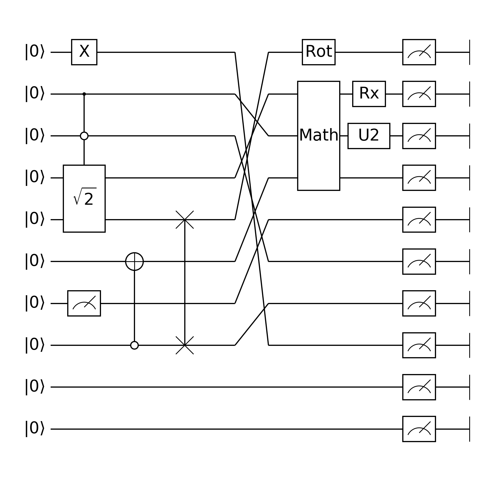

# Circuit Visualization Protocal
## Demo
This is the `circuit.yaml` file,
```yaml
DISP_LEVEL: 2
DISP_INITIAL: true
DISP_PARAMS: true
name: "Circuit"
nline: 10
blocks:
    -
        DISP: true
        name: "Rotation"
        nline: 7
        blocks:
            - "/X(0)"
            - "/C(1)--/NC(2) -- /G(3:5, $\\sqrt{2}$, 0.3 & 0.4)"
            - "/Measure(6);"
            - "/NC(7)--/NOT(5);"
            - "/Swap(4 & 7);"
            - "/Focus(7 & 2 & 5 & 1);"
            -
                DISP: false
                name: "R1"
                nline: 4
                blocks:
                    - "/Rot(0, 0.2 & 0 & 0.5)"
                    - "/G(1:4, Math,);"

    -
        DISP: true
        name: "R1"
        nline: 4
        blocks:
            - "/Rx(1, 0.4)"
            - "/G(2:3, U2,);"
    - "/Measure(0:10);"
    - "/End(0:10)"
```

As a result, we can get


## Gate Representation
A gate or an operation start with `/`.

* Non-Parametric Single-Qubit Gates like `G(line)`, where `line` is an integer
    * C, NC  # Control and N-Control
    * X, Y, Z, H
    * NOT
* Non-Parametric Multi-Qubit Gates like `G(lines)`, where `lines` can be an integer, slice or list, e.g. `2`, `1&2&3`, `1:4` (which is equivalent to `1&2&3`).

    * Swap  # number of line must be 2.
    * Focus
    * Measure
    * End
* Parametric Gates like `G(line(s), floats)`, `floats` here can be e.g. `0.2&0.3`, `0.2`.

    * Rx, Ry, Rz
    * Rot
* General Gates with Names like `G(line(s), text, float(s))`,
  if no parameter, it is `G(line(s), text,)`.

    * G

## Block Tree
* `blocks` contains a list of blocks, and for each block, it contains

    * name: str
    * nline: int
    * blocks: list
    * DISP_OFFSETX: float
    * DISP: bool, whether this box is visible.

Where `DISP*` variables are for display purpose, which is not related to circuit definition.

## Notes

####  Reserved strings for naming a general Gate

* "--" used to split column wise connected gates.
