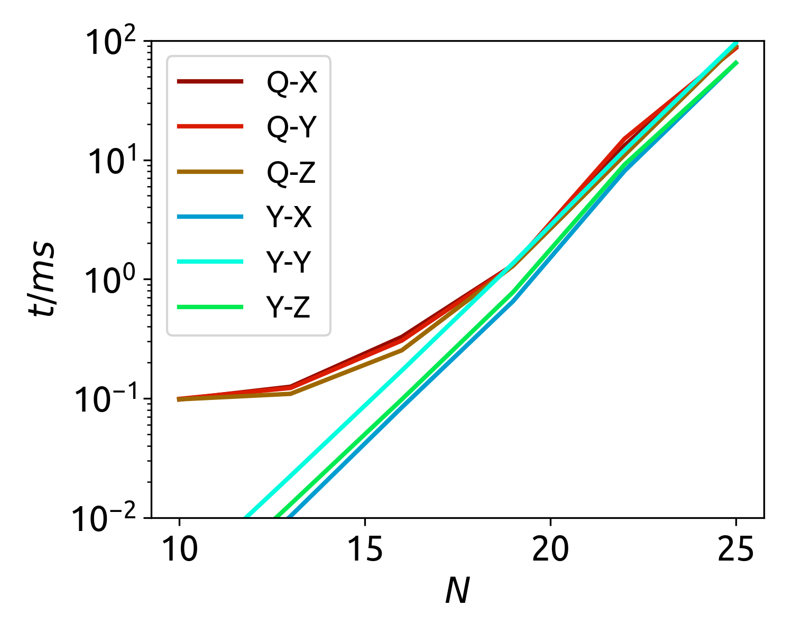
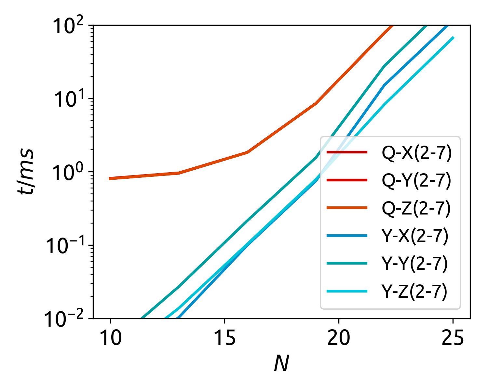
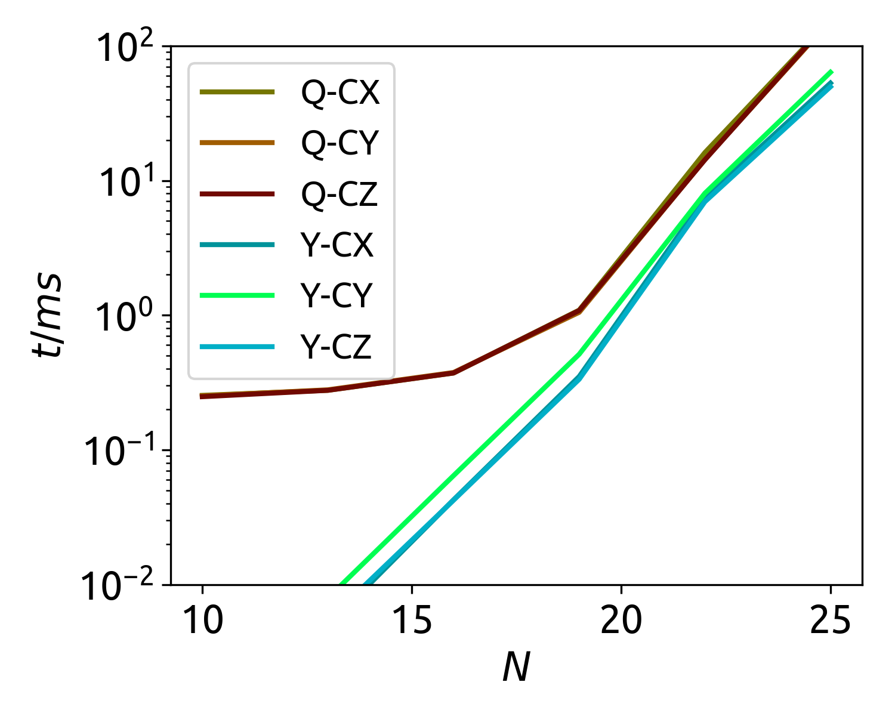
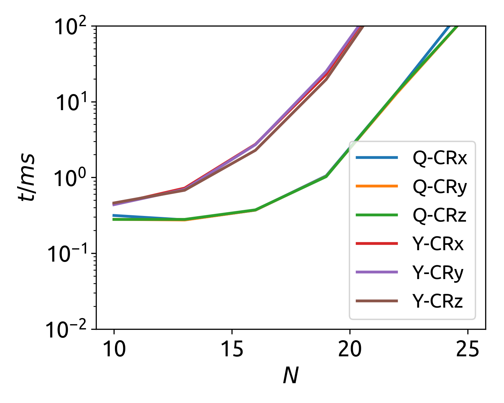
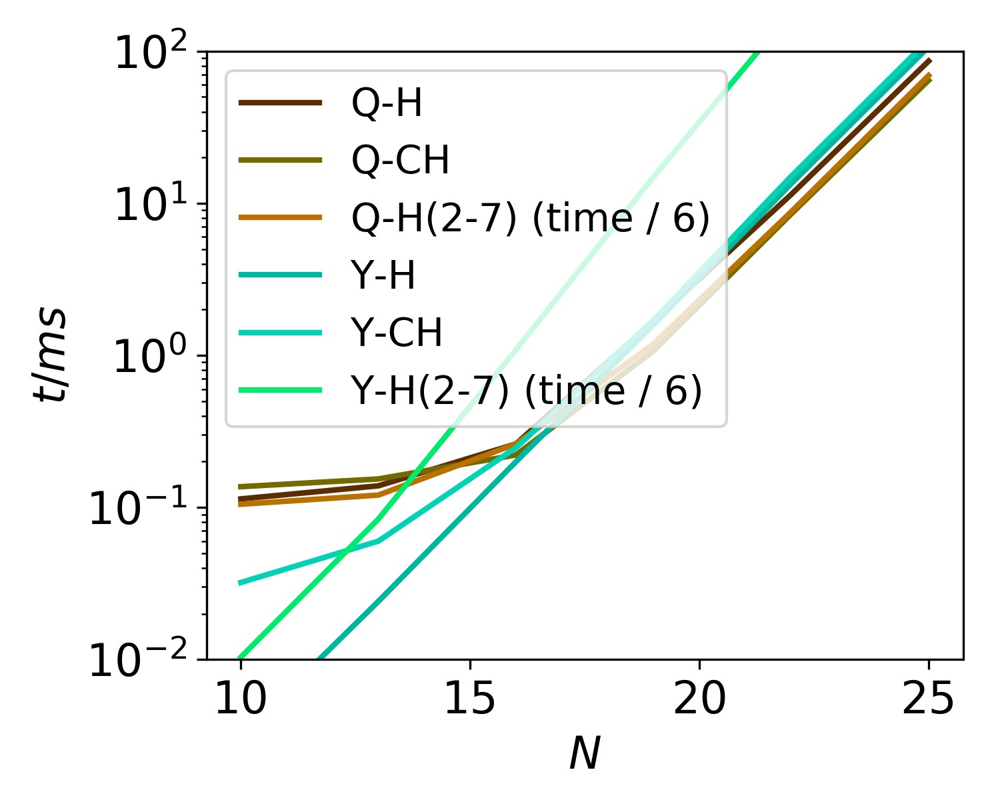
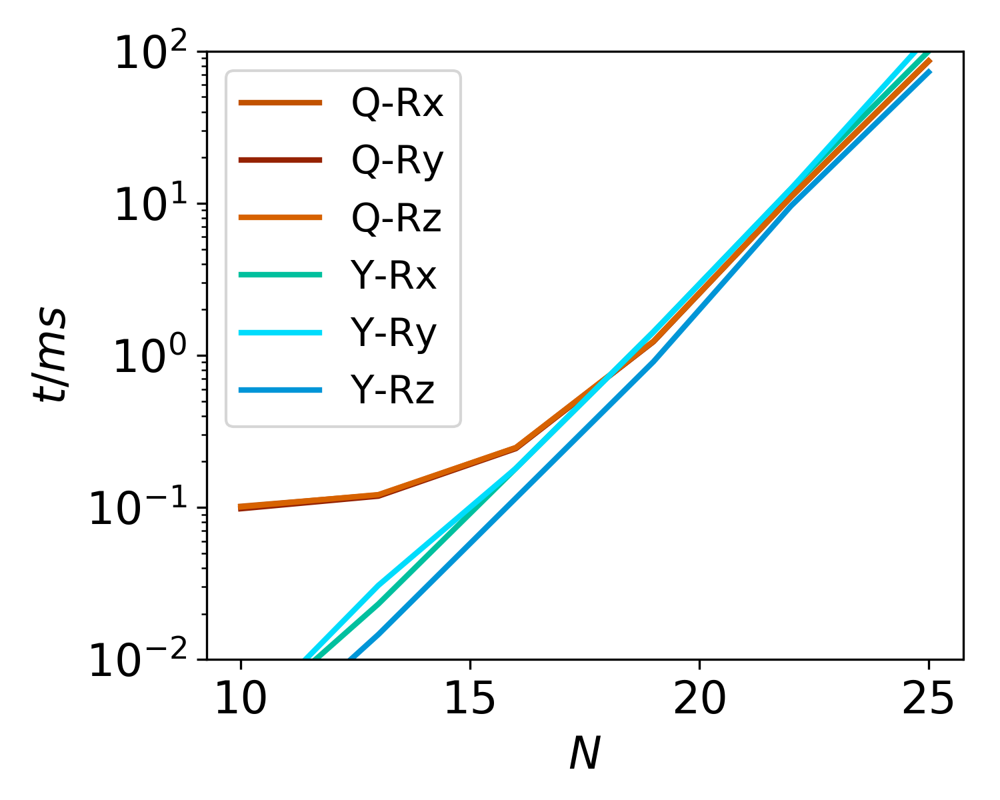

# Benchmark with ProjectQ
[ProjectQ](https://projectq.ch) is an open source software framework for quantum computing. Here we present the single process benchmark result








From this benchmark, we see the performance of ProjectQ and Yao.jl are quite similar, both of them are close to the theoretical bound in performance.

ProjectQ is a state of art quantum simulator, it kept the record of 45 qubit quantum circuit simulation for several months: https://arxiv.org/abs/1704.01127 4
It uses parallisms like SIMD, OpenMP, MPI to speed up calculation.

ProjectQ has C++ backend, while Yao.jl uses pure julia. Yao.jl has significantly less overhead than ProjectQ, which benefits from julia’s jit and multile dispatch.

In some benchmarks, like repeated blocks, Yao.jl can perform much better, this is an algorithmic win. Thanks to julia’s multiple dispatch, we can dispatch any advanced-speciallized algortihm to push the performance for frequently used gates easily, without touching the backend!

## CPU Information

```
Architecture:          x86_64
CPU op-mode(s):        32-bit, 64-bit
Byte Order:            Little Endian
CPU(s):                48
On-line CPU(s) list:   0-47
Thread(s) per core:    2
Core(s) per socket:    12
Socket(s):             2
NUMA node(s):          2
Vendor ID:             GenuineIntel
CPU family:            6
Model:                 79
Stepping:              1
CPU MHz:               2499.921
BogoMIPS:              4401.40
Virtualization:        VT-x
L1d cache:             32K
L1i cache:             32K
L2 cache:              256K
L3 cache:              30720K
NUMA node0 CPU(s):     0-11,24-35
NUMA node1 CPU(s):     12-23,36-47
```

#### ProjectQ
We use ProjectQ v0.3.6 in this benchmark, with python version 3.6.
* [Github Repo](https://github.com/ProjectQ-Framework/ProjectQ)
* Damian S. Steiger, Thomas Häner, and Matthias Troyer "ProjectQ: An Open Source Software Framework for Quantum Computing" [arxiv:1612.08091]
* Thomas Häner, Damian S. Steiger, Krysta M. Svore, and Matthias Troyer "A Software Methodology for Compiling Quantum Programs" [arxiv:1604.01401]

## Julia Version

```
Julia Version 0.7.0-alpha.147
Commit 5e3259e (2018-06-16 18:43 UTC)
Platform Info:
  OS: Linux (x86_64-linux-gnu)
  CPU: Intel(R) Xeon(R) CPU E5-2650 v4 @ 2.20GHz
  WORD_SIZE: 64
  LIBM: libopenlibm
  LLVM: libLLVM-6.0.0 (ORCJIT, broadwell)
```
