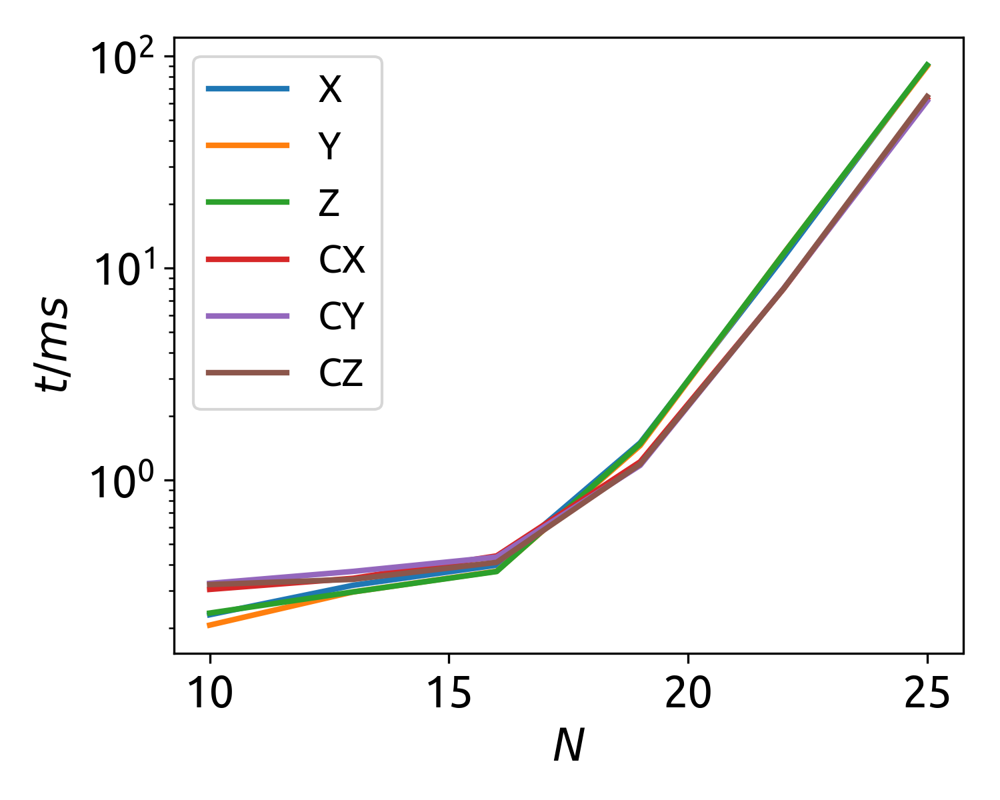
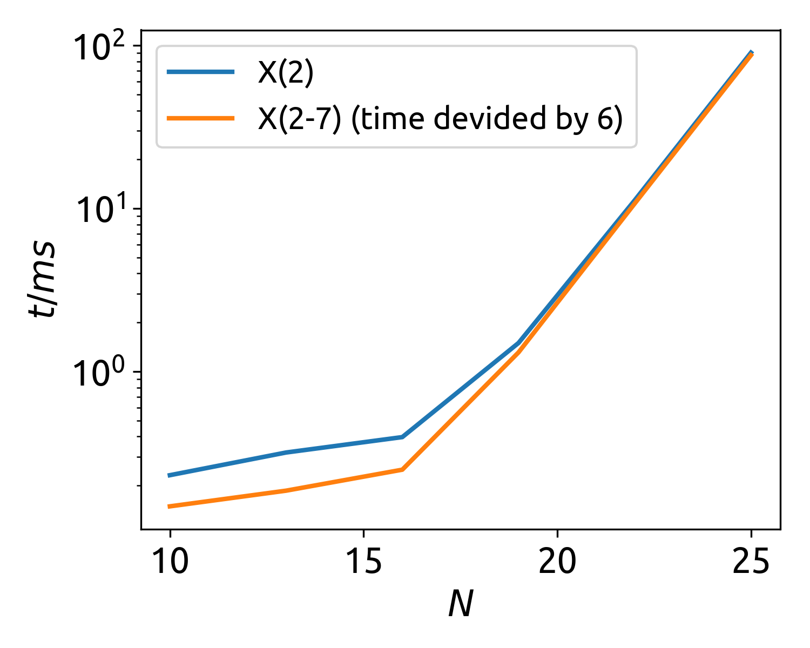

# Benchmark with ProjectQ
[ProjectQ](https://projectq.ch) is an open source software framework for quantum computing.

## Single Gate Performance

Following is the single qubit gate performance of ProjectQ, by applying X gate on 2nd qubit in a Hilbert space of N = 16 qubits. For system size N > 20, there is no significant overhead, indicated by perfect exponential scaling.

## Repeated Gate Performance

If we apply same gate, X, Y, Z on 6 qubits 2-7, we compare their performance with single qubit case.

Here, we see the reason why we need `Block` system and multiple dispatch to do structure specific optimization.

#### ProjectQ Refs
* [Github Repo](https://github.com/ProjectQ-Framework/ProjectQ)
* Damian S. Steiger, Thomas Häner, and Matthias Troyer "ProjectQ: An Open Source Software Framework for Quantum Computing" [arxiv:1612.08091]
* Thomas Häner, Damian S. Steiger, Krysta M. Svore, and Matthias Troyer "A Software Methodology for Compiling Quantum Programs" [arxiv:1604.01401]

## CPU Information
Intel(R) Core(TM) i5-7200U CPU @ 2.50GHz
