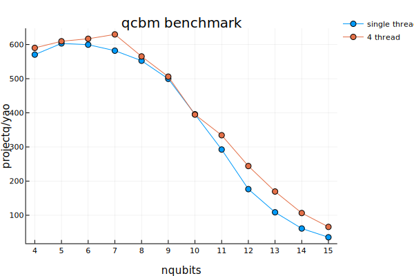

# Benchmarks

Each component package of Yao has a benchmark test based on [PkgBenchmark](https://github.com/JuliaCI/PkgBenchmark.jl)

To run the benchmarks, simply type

```julia
using PkgBenchmark

benchmarkpkg("YaoArrayRegister")
benchmarkpkg("YaoBlocks")
```

You can also compare the benchmark between different commits and pull requests. Check the [documentation](https://juliaci.github.io/PkgBenchmark.jl/stable/index.html) of **PkgBenchmark** for more details.

## Single Gate Benchmarks against ProjectQ

Click the image to check the interactive plot.

```@raw html
<div>
    <a href="https://plot.ly/~rogerluo.rl18/1/?share_key=nUtdrjZojW6kZEbO6JwnPW" target="_blank" title="Yao-ProjectQ-Benchmarks" style="display: block; text-align: center;"></a>
    <script data-plotly="rogerluo.rl18:1" sharekey-plotly="nUtdrjZojW6kZEbO6JwnPW" src="https://plot.ly/embed.js" async></script>
</div>
```

## QCBM Benchmark against ProjectQ

The ProjectQ based implementation can be found at: [github:QuantumCircuitBornMachine#benchmarkq](https://github.com/GiggleLiu/QuantumCircuitBornMachine/tree/benchmarkq)




## Configuration Info:

```julia
Julia Version 1.1.0
Commit 80516ca202 (2019-01-21 21:24 UTC)
Platform Info:
  OS: macOS (x86_64-apple-darwin18.5.0)
  CPU: Intel(R) Core(TM) i7-7700HQ CPU @ 2.80GHz
  WORD_SIZE: 64
  LIBM: libopenlibm
  LLVM: libLLVM-6.0.1 (ORCJIT, skylake)
```

### Package Info

**Yao**:

```julia
(v1.1) pkg> status Yao
    Status `~/.julia/environments/v1.1/Project.toml`
  [50ba71b6] BitBasis v0.5.1 [`../../dev/BitBasis`]
  [5872b779] Yao v0.5.0 [`~/.julia/dev/Yao`]
  [e600142f] YaoArrayRegister v0.3.8 [`~/.julia/dev/YaoArrayRegister`]
  [a8f54c17] YaoBase v0.9.1 [`~/.julia/dev/YaoBase`]
  [418bc28f] YaoBlocks v0.4.0 [`~/.julia/dev/YaoBlocks`]
```

**ProjectQ**:

```python
In [2]: projectq.__version__
Out[2]: '0.4.2'
```

```
# packages in environment:
#
# Name                    Version                   Build  Channel
cffi                      1.12.2           py37hb5b8e2f_1
chardet                   3.0.4                    py37_1
libcxx                    4.0.1                hcfea43d_1
libcxxabi                 4.0.1                hcfea43d_1
libffi                    3.2.1                h475c297_4
libgfortran               3.0.1                h93005f0_2
libiconv                  1.15                 hdd342a3_7
libpng                    1.6.37               ha441bb4_0
libsodium                 1.0.16               h3efe00b_0
mkl                       2019.3                      199
mkl-service               1.1.2            py37hfbe908c_5
mkl_fft                   1.0.12           py37h5e564d8_0
mkl_random                1.0.2            py37h27c97d8_0
pytest                    4.5.0                    py37_0
pytest-benchmark          3.2.2                    py37_0
python                    3.7.3                h359304d_0
python-dateutil           2.8.0                    py37_0
python.app                2                        py37_9
yaml                      0.1.7                hc338f04_2
zeromq                    4.3.1                h0a44026_3
zlib                      1.2.11               h1de35cc_3
```
